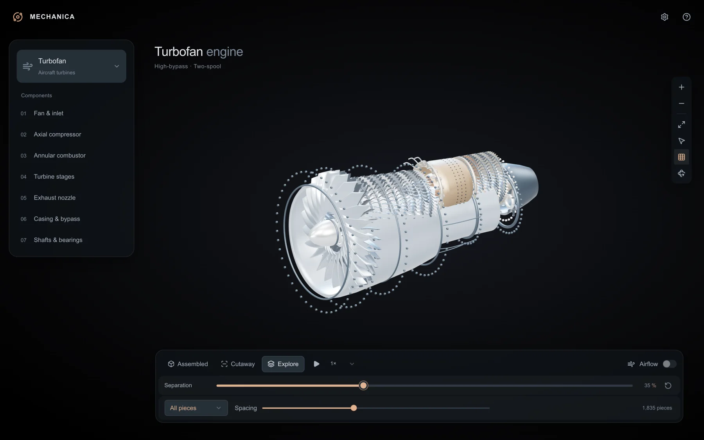
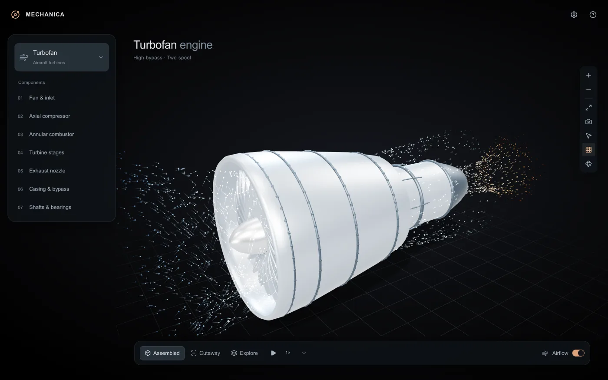
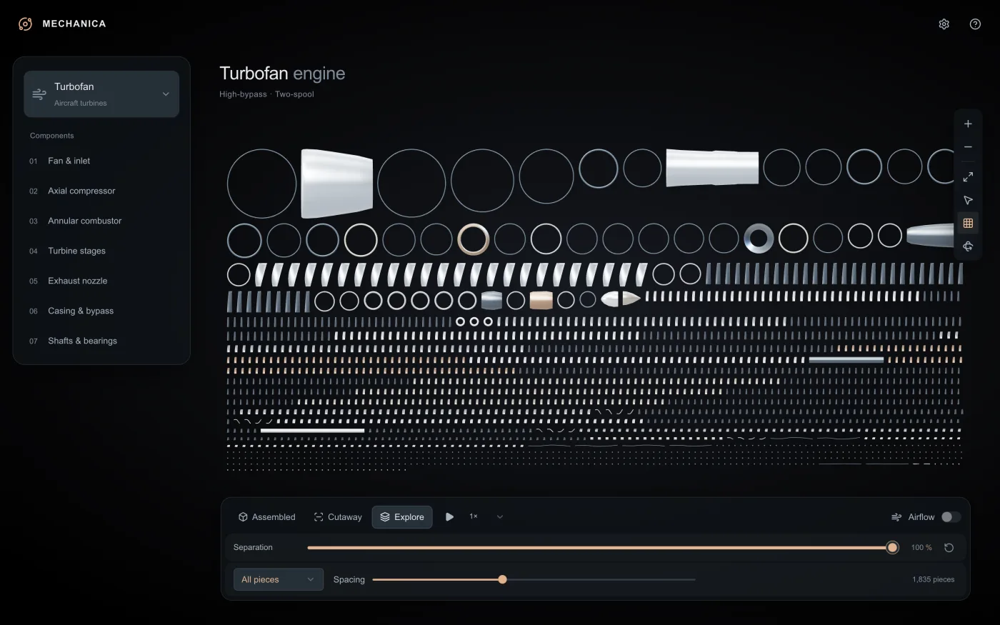
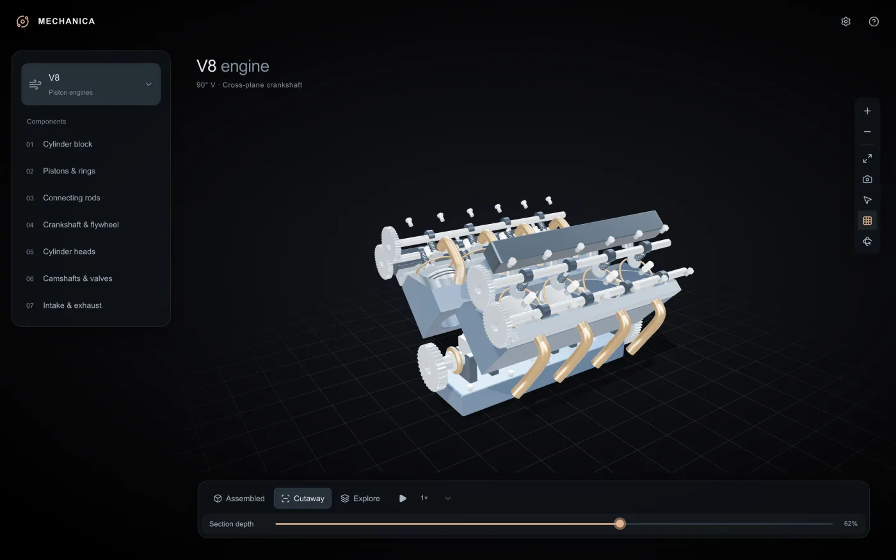
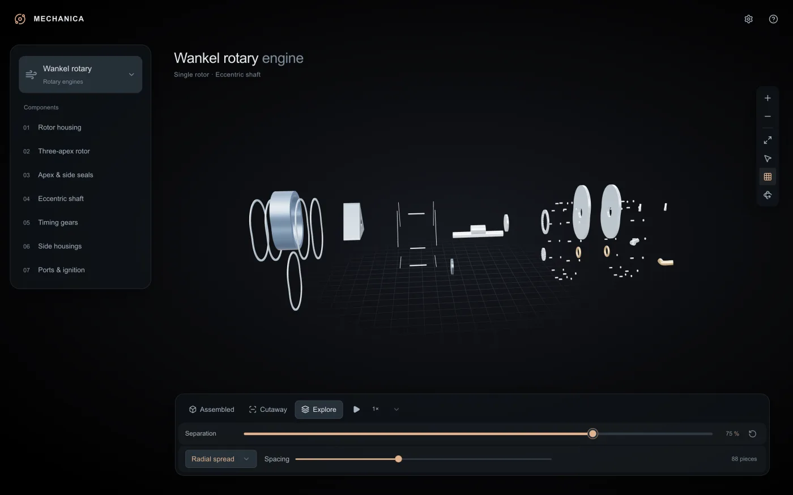
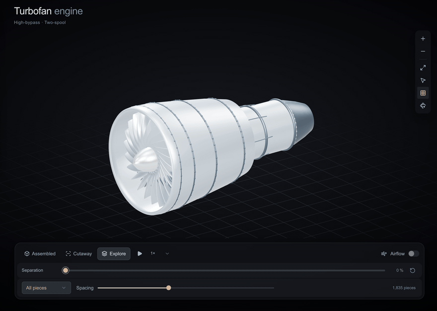
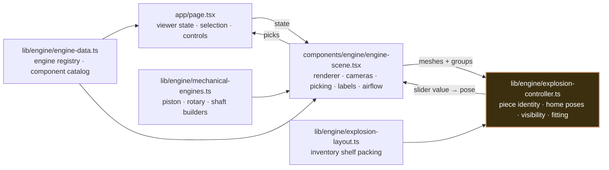

<div align="center">


# Mechanica

**Seven engines you can take apart, piece by piece, in the browser.**

Turbofan, turbojet, turboprop, turboshaft, V8, inline-four and Wankel rotary, every one an original
parametric model built in code. Spin the mechanism, slice it open, follow the air through it, then
drag one slider from a fully assembled engine to every single bolt laid out on a shelf, and back again.

[](https://mechanica-atlas.vercel.app)
[](https://github.com/PouyanJay/mechanica/releases)
[](https://github.com/PouyanJay/mechanica/actions/workflows/ci.yml)
[](LICENSE)
[](tsconfig.json)
[](app)
[](components/engine)
[](vite.config.ts)
[](worker)

[Why it exists](#why-it-exists) ·
[What you can do](#what-you-can-do) ·
[The engines](#the-engines) ·
[How it works](#how-it-works) ·
[Quick start](#quick-start) ·
[Project layout](#project-layout) ·
[Verification](#verification) ·
[Deployment](#deployment) ·
[Docs](#documentation)

[**▶ Open the live app**](https://mechanica-atlas.vercel.app) · no install, needs a WebGL2 browser

[**🎬 Watch the 4K demo**](https://github.com/PouyanJay/mechanica/releases/download/v0.1.0/mechanica-demo-4k.mp4) · 100 seconds, narrated



</div>

---

## Why it exists

Engine diagrams flatten a machine into one view. Physical cutaways show one slice. Neither lets you
ask the question that actually teaches you how an engine works: *what is this part, what does it touch,
and what happens if I pull it out?*

Mechanica answers that with a continuous, reversible separation. One slider runs from a complete
assembly to every independent piece in inventory. Stop anywhere and the engine is a real intermediate
state you can orbit, pick and isolate, not a canned animation. Drag back to zero and every piece returns
to its exact captured pose, even if the mechanism was mid-rotation when you started.

| Idea | What it means in the app |
|---|---|
| **Geometry is code** | Every engine is a parametric builder in TypeScript. No CAD files, no textures, no downloads. |
| **Separation is a state, not a clip** | Piece poses are derived from a captured home transform and the slider value. The same value always produces the same pose, in either direction. |
| **Pieces keep their identity** | Repeated hardware is instanced for speed, but every bolt, blade and ring is individually selectable, hideable and countable. |
| **Mechanisms stay honest** | Piston rods keep a fixed length across the whole crank cycle. The rotary shaft turns exactly three times per rotor revolution. The test suite asserts it. |

## What you can do

- **Follow a guided walkthrough** from the console or Help. Step through the working fluid path or combustion cycle, read short explanations, and see the involved components highlighted. Arrow keys step, Space pauses, and Escape returns to exploration at the current view. The speed control sets the automatic pace.
- **Inspect** any of seven engines. Pick a component group from the list or click it in the scene to read what it does, what it touches and what it is made of.
- **Cut it open** with a section plane and a depth slider. Play the mechanism while it is sliced.
- **Follow the air** through the turbine engines with a schematic streakline overlay: bypass, core, combustion and exhaust.
- **Take it apart** with the separation slider. The first stretch loosens the assembly while keeping orientation; past the midpoint every piece spreads into an inventory shelf or a radial cloud. Adjust spacing, or let it cycle.
- **Isolate** a single piece out of nearly two thousand, hide whole groups, and fit the camera to what is left.
- **Switch views** between perspective, orthographic, side and front cameras, toggle labels, the floor grid and auto-rotate, and choose a dark or light theme.

<div align="center">
<table>
  <tr>
    <td align="center"><a href="docs/assets/turbofan-airflow.webp"></a></td>
    <td align="center"><a href="docs/assets/turbofan-inventory.webp"></a></td>
  </tr>
  <tr>
    <td align="center"><sub><b>Airflow</b> · schematic streaklines through the fan, core and nozzle</sub></td>
    <td align="center"><sub><b>Every piece</b> · 1,835 parts packed by projected bounds</sub></td>
  </tr>
  <tr>
    <td align="center"><a href="docs/assets/v8-cutaway.webp"></a></td>
    <td align="center"><a href="docs/assets/rotary-radial.webp"></a></td>
  </tr>
  <tr>
    <td align="center"><sub><b>Cutaway</b> · V8 with the section plane at 62 percent</sub></td>
    <td align="center"><sub><b>Radial spread</b> · Wankel rotary at 75 percent separation</sub></td>
  </tr>
</table>
</div>

<div align="center">

<br/><sub>The separation slider, scrubbed forward and back. Every frame is a deterministic state.</sub>
</div>

## The engines

| Engine | Family | Mechanism in the model |
|---|---|---|
| **Turbofan** | Aircraft turbine | High-bypass, two-spool. Concentric shafts link the turbines to the fan and compressor. |
| **Turbojet** | Aircraft turbine | Single-spool axial flow. All intake air passes through the core to the nozzle. |
| **Turboprop** | Aircraft turbine | Gas generator plus free power turbine driving a five-blade propeller through reduction gearing. |
| **Turboshaft** | Aircraft turbine | Free power turbine with a geared output flange for an external load. |
| **V8** | Piston | 90 degree V, cross-plane crankshaft, two-valve heads, camshafts at half crank speed. |
| **Inline-four** | Piston | Single bank, double overhead cam. Outer pistons move together, opposite the middle pair. |
| **Wankel rotary** | Rotary | Three-apex rotor in an epitrochoid housing on an eccentric shaft, 3:1 shaft-to-rotor ratio. |

These are educational reference models of generic architectures, not replicas of any manufacturer's
engine. Stage counts, proportions and surface details are illustrative. Playback is slowed for
inspection, and the airflow overlay is schematic rather than a CFD result.

## How it works

The page owns UI state. The scene component owns the Three.js world. A separation controller sits
between them and gives every rendered instance a logical identity, a captured home pose and a derived
current pose.



| Stage of the slider | What happens |
|---|---|
| **0** | Every piece sits at its captured home matrix. If the mechanism was running, that running pose is the home. |
| **0 to 0.45** | The assembly loosens along its axis. Pieces keep their orientation so the engine still reads as an engine. |
| **0.45** | A continuous handoff. The test suite checks the pose on both sides of the boundary agrees to within 1e-4. |
| **0.45 to 1** | Pieces travel to their layout slot: an orthographic inventory shelf packed by projected bounds, or a radial spread. |
| **1** | Every independent piece is visible and disjoint. Surface markings stay attached to their host and do not count. |

Turbine geometry is built inside the scene module; piston, rotary and shaft-output geometry live in
their own builder. Repeated hardware uses instanced meshes, and the controller maps each instance back
to a stable piece id so picking, isolation and counts stay exact. Full detail, including how to add an
engine, is in [docs/ARCHITECTURE.md](docs/ARCHITECTURE.md).

## Quick start

Node.js 22.13 or newer (see `.nvmrc`) and a browser with WebGL2. No API key, database or cloud account.

```sh
git clone https://github.com/PouyanJay/mechanica.git
cd mechanica
make run
```

`make run` installs dependencies, starts the dev server on a free port with a health check, and prints
the URL. `make help` lists every target.

| Command | Purpose |
|---|---|
| `make run` | Install, then start the dev server |
| `make stop` / `make logs` | Stop the server, or follow its log |
| `make build` | Production build (browser assets plus Worker) into `dist/` |
| `make test-engines` | Numeric checks on all seven engines, no build needed |
| `make test-ui` | Build, then rendered-HTML and UI component tests |
| `make test` | Everything |
| `make lint` | ESLint |

The equivalent npm scripts are `dev:local`, `build:local`, `start:local`, `test:engines`, `test:local`
and `lint`. The app is served by Vinext (the Next.js app router on Vite) with a Cloudflare Worker entry,
so use its server rather than opening files directly.

## Project layout

```
app/                  Routes, root layout and global styles. No engine logic here.
components/
  engine/             The Three.js scene component: builders, lighting, cameras, picking
  ui/                 Vendored shadcn primitives
lib/
  engine/             Engine catalog, mechanical builders, separation controller, packing
hooks/                Shared React hooks
worker/               Cloudflare Worker entry
tooling/              Vite build plugins
scripts/              Makefile targets, install and run helpers, the engine check
tests/                Rendered-HTML and UI component tests
docs/                 Architecture notes, handoff record, README assets
public/               Static assets
vendor/               Bundled shadcn stylesheet with its license
```

## Verification

The engine check in [scripts/check-explosion.mjs](scripts/check-explosion.mjs) compiles the real
builders and drives the real separation controller under a DOM stub. For every engine it asserts:

- every component group contains meshes, and every instance has a distinct stable id;
- 42 inventory configurations across three aspect ratios and hidden-group states produce disjoint bounding boxes;
- scrubbing forward and backward through 0, 10, 25, 45, 60, 80 and 100 percent yields identical poses, and the 0.45 boundary is continuous;
- separating and reassembling five times after capturing a running mechanism returns every piece to its home matrix;
- single-piece isolation picks exactly that piece;
- piston rods hold their length and follow the wrist pin through the crank cycle, and rotary apexes trace the housing locus at a 3:1 ratio;
- no em dashes or en dashes appear in the UI copy.

CI runs lint, the engine check, a production build and the UI tests on every push and pull request.
Numeric checks do not judge visual quality, so rendering changes are reviewed in a browser as well.

## Documentation

| Doc | Read it for |
|---|---|
| [docs/ARCHITECTURE.md](docs/ARCHITECTURE.md) | Data flow, the separation contract, mechanism constraints, and the checklist for adding an engine |
| [docs/HANDOFF.md](docs/HANDOFF.md) | Provenance and tooling record from the original handoff |
| [CONTRIBUTING.md](CONTRIBUTING.md) | Setup, the verification matrix, and conventions |

## Deployment

The live app at [mechanica-atlas.vercel.app](https://mechanica-atlas.vercel.app) is deployed by
Vercel's Git integration: every push to `main` becomes a production deployment, and every pull request
gets its own preview URL. `vercel.json` tells Vercel to build with `npm run build:next`, a plain
`next build` that prerenders the page as static content, so no Cloudflare binding is needed there.
CI runs the same build on every push to catch a broken deployment before Vercel does.

The Cloudflare Worker target is unchanged. `npm run build:local` still produces `dist/` with the
Worker and client assets, and `.openai/hosting.json` still declares the optional D1 and R2 bindings
that the Vite config imports, so keep it in place even when both values are null.
`python3 scripts/export-repository.py <zip path>` produces a source-only archive of the current commit.

## License

[MIT](LICENSE) © Pouyan Jahangiri. Third-party packages keep their own licenses;
`vendor/shadcn-tailwind-4.13.0.LICENSE.md` must stay with its stylesheet.
